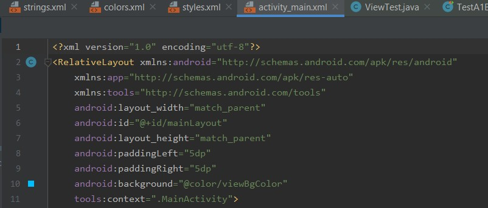
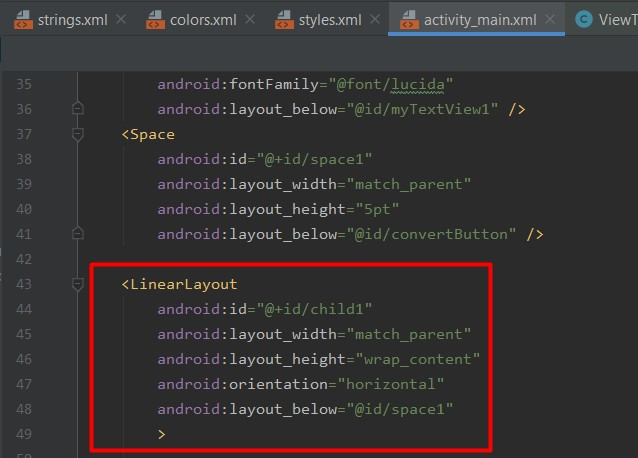
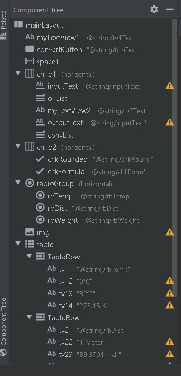
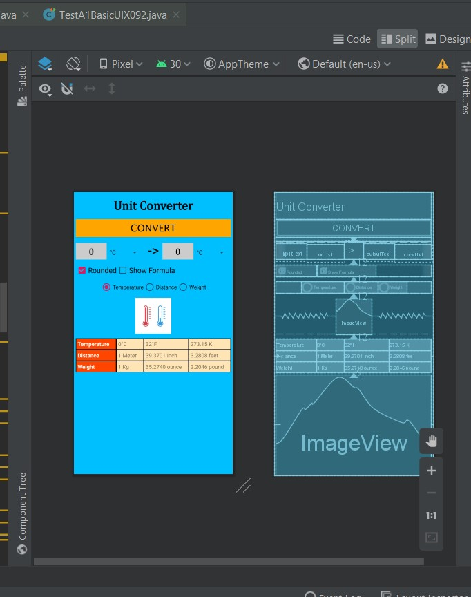

# 01 - Hello World

## Tujuan Pembelajaran

1. Mahasiswa memahami konsep layout pada android.
2. Mahasiswa mampu membuat layout sederhana.

## Hasil Praktikum

1. Hasil dari Konsep Layout
   a. Relative Layout
   
   b. Linear Layout
   
2. Membuat Layout Sederhana
   a. Komponen Layout
   
   b. Hasil Tampilan Layout
   
