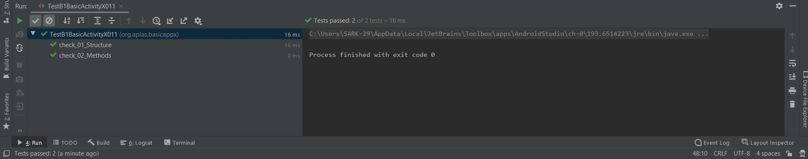
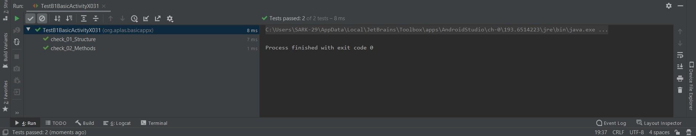
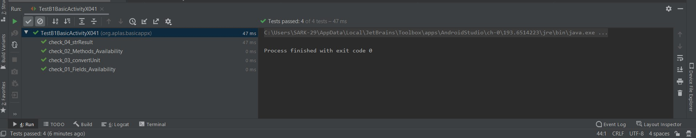
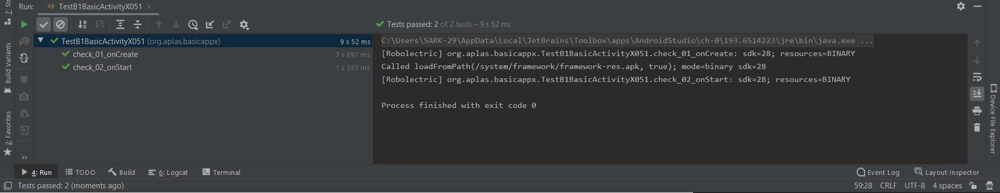
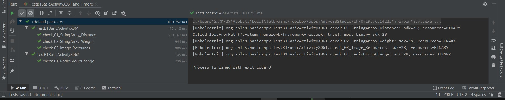
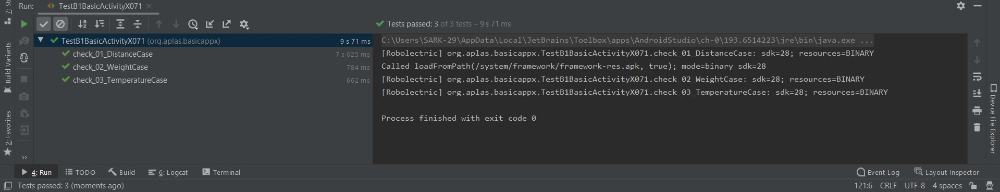
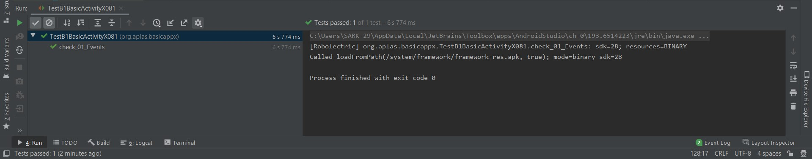
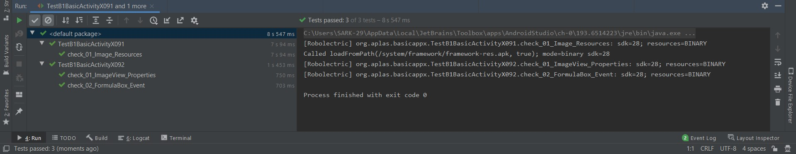

# 03 - Basic Activity

## Tujuan Pembelajaran

1. Mahasiswa mampu membuat Kelas Temperature untuk Convert unit
2. Mahasiswa mampu membuat Kelas Distance untuk Convert unit
3. Mahasiswa mampu membuat Kelas Bobot untuk Convert unit
4. Mahasiswa mampu membuat Field dan Method pada Kelas Main Activity
5. Mahasiswa memahami Activity Lifecycle saat oncreate dan on Start.
6. Mahasiswa memahami tentang mengganti event pada radiogroup dan mengganti spinner content
7. Mahasiswa mampu membuat method untuk melakukan konversi
8. Mahasiswa mampu membuat beberapa event untuk Button, spinner dan checkbox
9. Mahasiswa mampu membuat membuat elemen gambar dan menampilkan saat checkboxnya dicentang.

## Hasil Praktikum

a. Hasil 1

b. Hasil 2

c. Hasil 3

d. Hasil 4

e. Hasil 5

f. Hasil 6

g. Hasil 7

h. Hasil 8

i. Hasil 9

