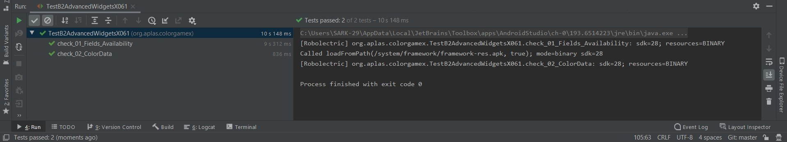

# 04 - Advanced Widgets

## Tujuan Pembelajaran

1. Mahasiswa akan memulai proyek untuk membuat aplikasi Android game sederhana.
2. Mahasiswa akan mengerti bagaimana menangani pengatur waktu dan menghitung skor
3. Mahasiswa akan memahami tentang gaya, tema, dan gambar vektor yang dapat digambar.
4. Mahasiswa akan membuat UI untuk proyek Color Game dengan beberapa onClick
5. Mahasiswa akan mendeklarasikan field yang dibutuhkan oleh aplikasi dan mendefinisikan metode untuk periksa validitas untuk memasuki permainan.
6. Mahasiswa akan memahami cara kerja Countdowntimer.
7. Mahasiswa akan memahami bagaimana mengakses array dari resource dan memasukkannya ke dalamnya Daftar dan Hashtable.
8. Mahasiswa akan mengerti bagaimana memulai timer untuk memulai permainan.

## Hasil Praktikum

a. Hasil 1

b. Hasil 2

c. Hasil 3

d. Hasil 4

e. Hasil 5

f. Hasil 6

g. Hasil 7

h. Hasil 8

g. Hasil

