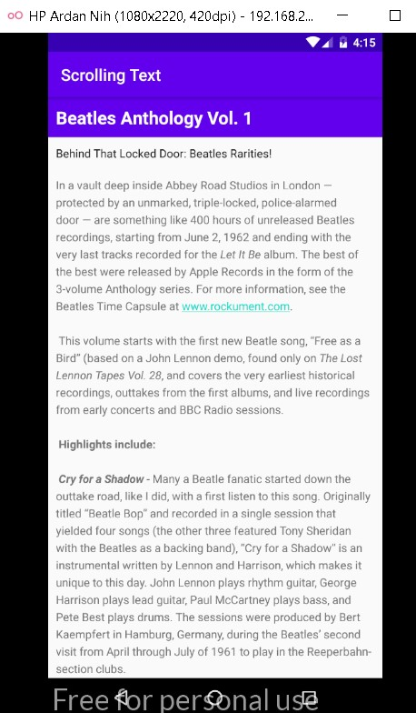
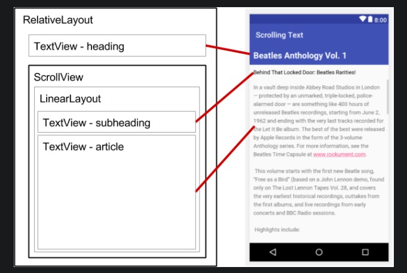
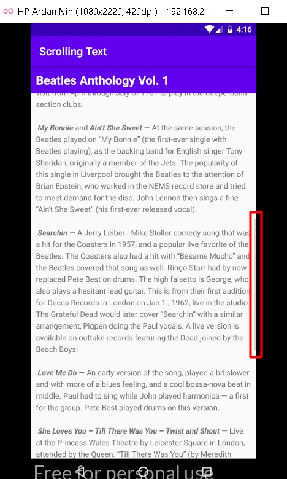
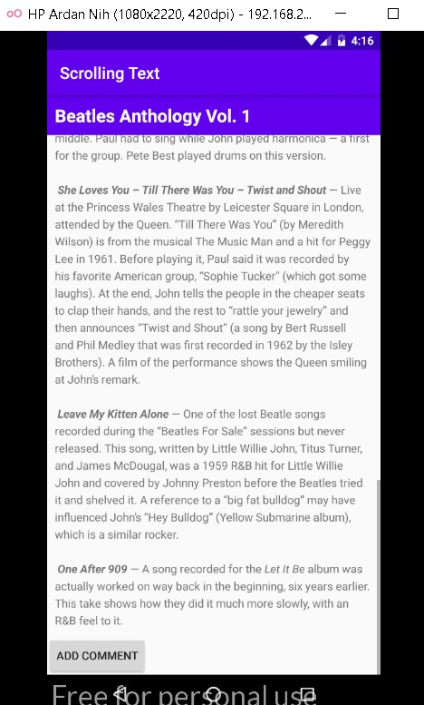

# 03 - Basic Activity

## Tujuan Pembelajaran

1. Cara menggunakan kode XML untuk menambahkan beberapa elemen TextView.
2. Cara menggunakan kode XML untuk menentukan tampilan bergulir.
3. Cara menampilkan teks bentuk bebas dengan beberapa tag pemformatan HTML.
4. Bagaimana memberi gaya pada warna latar belakang TextView dan warna teks.
5. Bagaimana cara memasukkan tautan web ke dalam teks.

## Hasil Praktikum

a. Hasil 1

Membuat Textview biasa

b. Hasil 2
Membuat scrollview dengan textview didalamnya. Agar bisa discroll

Hasil dari praktek akhirnya bisa discroll :

c. Hasil 3

Challange menambahkan button add comment, dan sukses.

