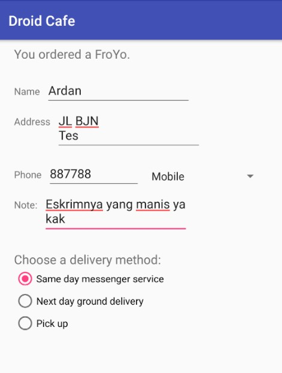
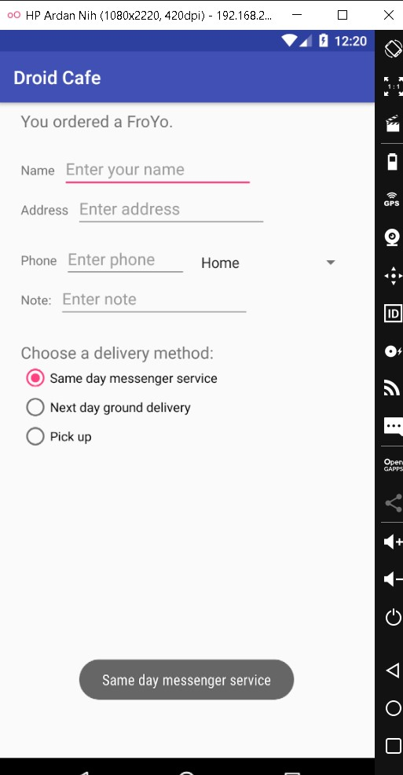
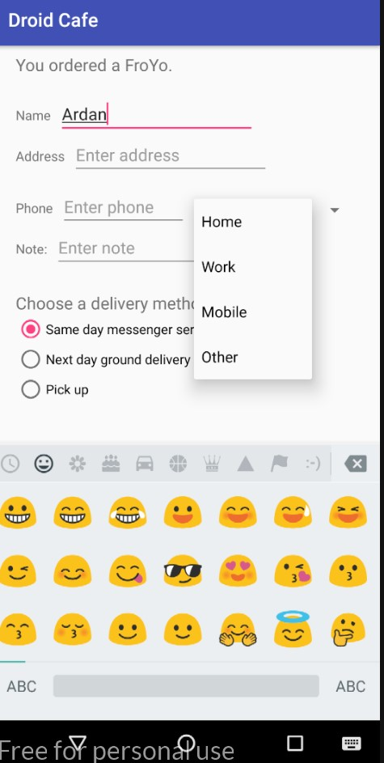
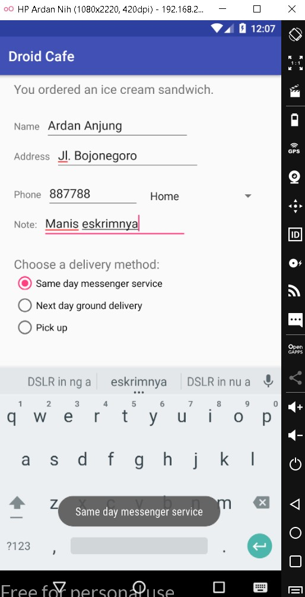

# 06 - Input Control

## Tujuan Pembelajaran

1. Menampilkan keyboard untuk memasukkan alamat email.
2. Menampilkan keypad numerik untuk memasukkan nomor telepon.
3. Mengizinkan entri teks beberapa baris dengan kapitalisasi kalimat otomatis.
4. Menambahkan tombol radio untuk memilih opsi.
5. Mensetel penangan onClick untuk tombol radio.
6. Menambahkan spinner untuk bidang nomor telepon untuk memilih satu nilai dari sekumpulan nilai.

## Hasil Praktikum

a. Hasil 1

Eksperimen Attribut Text Entri

)

b. Hasil 2

Menggunakan Radio Button

c. Hasil 3

Menggunakan Spinner

c. Hasil 4

Hasil Jadi

