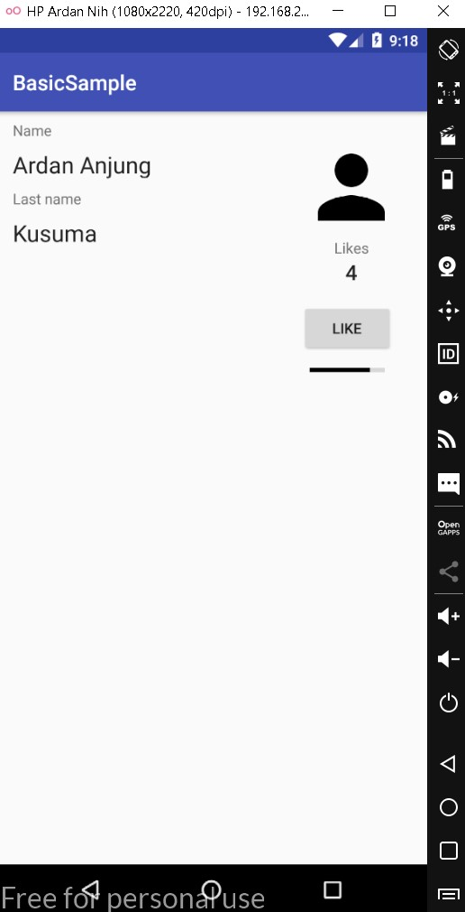
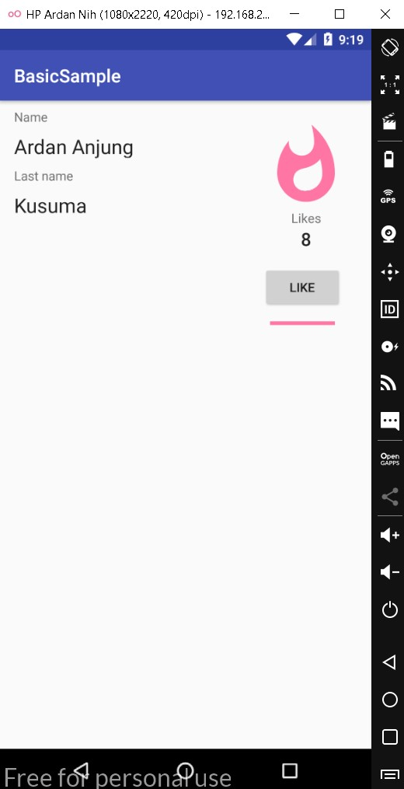
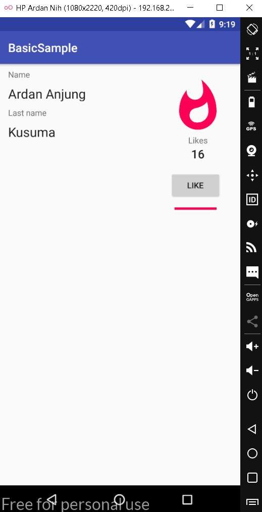

# 07 - Data Binding

## Tujuan Pembelajaran

1. Implementasi Data Binding Library pada Android

## Hasil Praktikum

a. Hasil Praktikum 1

Jika like kurang dari 5 maka masih belum berganti emoji

)

b. Hasil Praktikum 2

Jika like lebih 5 maka maka berganti emoji Like pink

)

c. Hasil Praktikum 3

Jika like lebih 15 maka maka berganti emoji Like merah

)
