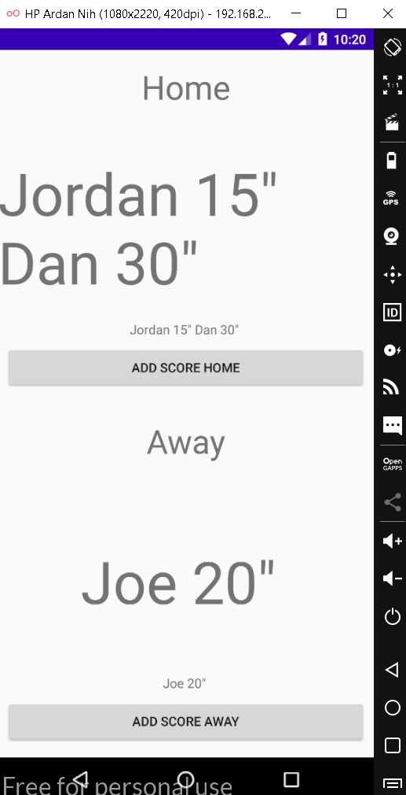
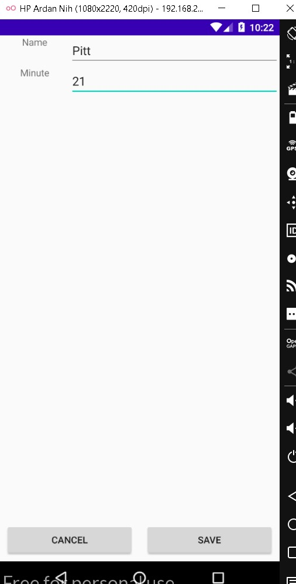
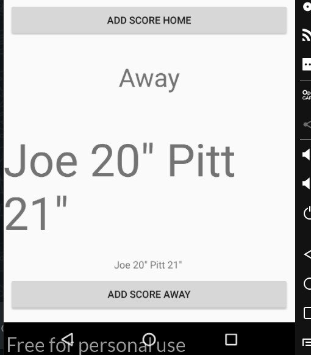

# 08 - View Model

## Tujuan Pembelajaran

1. Mahasiswa mengenal tentang arsitektur MVVM.
2. Mahasiswa memahami lifecycle viewmodel pada MVVM.
3. Mahasiswa mampu menerapkan viewmodel pada Android.

## Hasil Praktikum

a. Hasil Praktikum 1

Tampilan Home jika sudah diadd score

)

b. Hasil Praktikum 2

Mencoba menginputkan nama dan menit baru

)

c. Hasil Praktikum 3

Dan nama berhasil bertambah beserta menitnya

)
