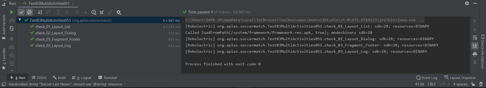

# 09 - Aplas Soccer Game

## Tujuan Pembelajaran

1. Mahasiswa mengenal tentang recycle view
2. Mahasiswa mengenal tentang fragment
3. Mahasiswa memahami intent antar activity

## Hasil Aplikasi

a. Hasil Aplikasi 1

b. Hasil Aplikasi 2

c. Hasil Aplikasi 1

## Praktikum

a. Hasil Praktikum 1

b. Hasil Praktikum 2

c. Hasil Praktikum 3

d. Hasil Praktikum 4

e. Hasil Praktikum 5

f. Hasil Praktikum 6

g. Hasil Praktikum 7

h. Hasil Praktikum 8

