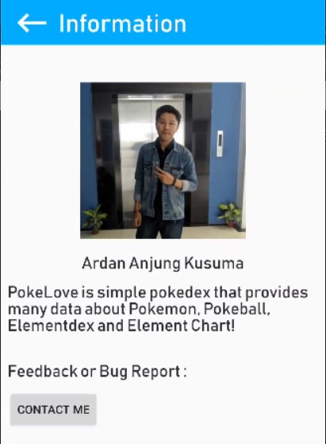
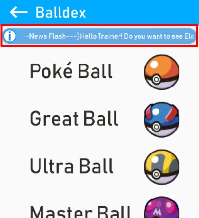
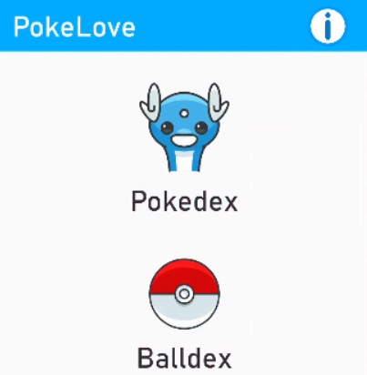
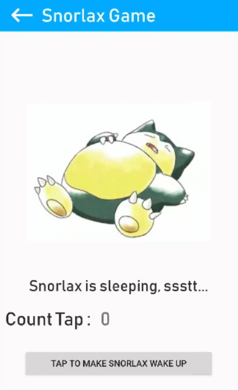
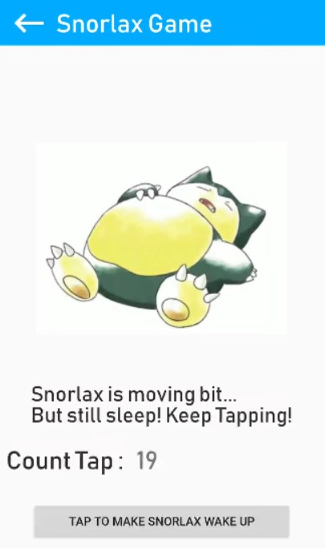
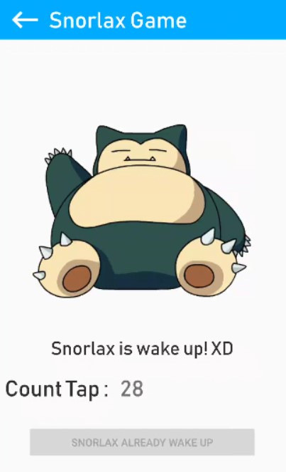

# Kuis 2

## Persyaratan Kuis

1. Implementasikan materi/pertemuan sebelumnya tentang data binding, fragment, navigation, dan ViewModel pada ide project akhir Anda! (minimal 1 fitur tiap materi tersebut)

## Hasil Kuis

a. Hasil Data Binding

Tampilan Informasi yang mengimplementasikan konsep data binding.

b. Hasil Fragment

Membuat fitur semacam news flash dengan menggunakan fragment, yang nantinya dapat diimplementasikan pada beberapa activity.

c. Hasil Navigation

Tombol Info dan Back

d. Hasil View Model

Membuat game dengan sistem tap (Wake up snorlax by tapping)

Count tap diset random

Dan saat mencapai nilai yang sama dengan nilai random snorlax bangun

