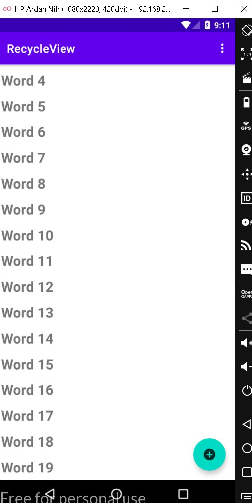
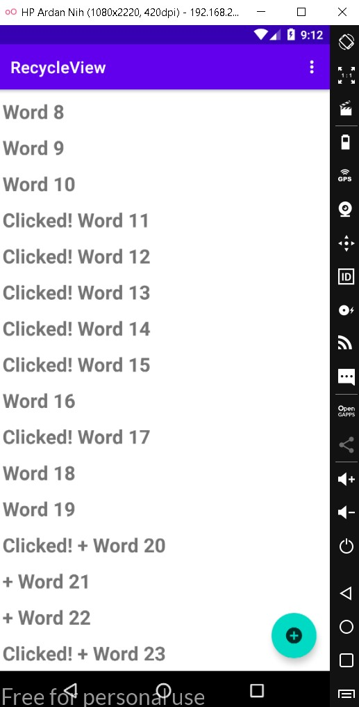
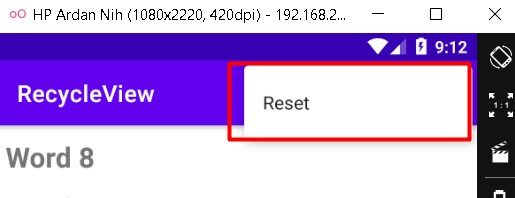
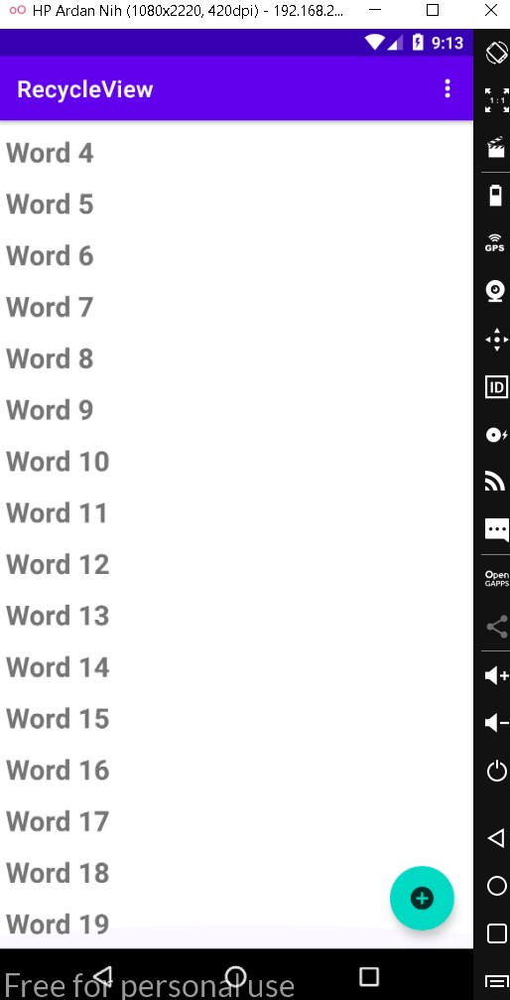
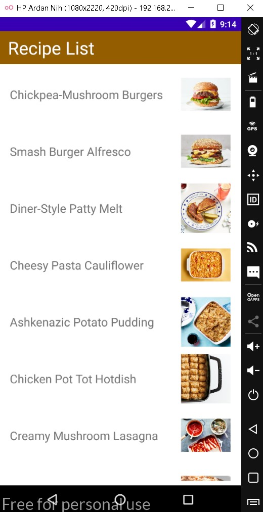
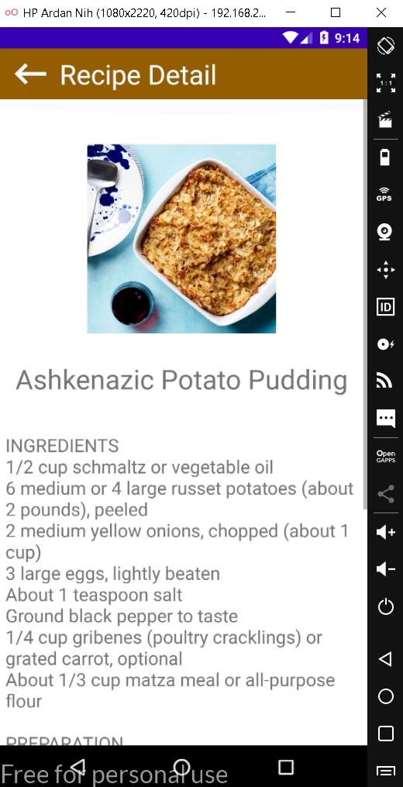

# 10 - Recycler View

## Tujuan Pembelajaran

1. Mahasiswa mampu menambahkan Recycler View pada aplikasi android;
2. Mahasiswa mampu menampilkan data sederhana dengan RecyclerView;
3. Mahasiswa mampu menerapkan Recycling ViewHolders;
4. Mahasiswa mampu menambahkan Data Binding ke Adapter.

## Hasil Aplikasi

a. Hasil Aplikasi Awal Saat Belum Ditambah Apa Apa

b. Hasil Aplikasi setelah diklik dan button tambah diklik

c. Tombol Reset

d. Tombol Reset Diklik

e. Tugas Resep Dengan Gambar

d. Tampilan saat melihat detail resep

