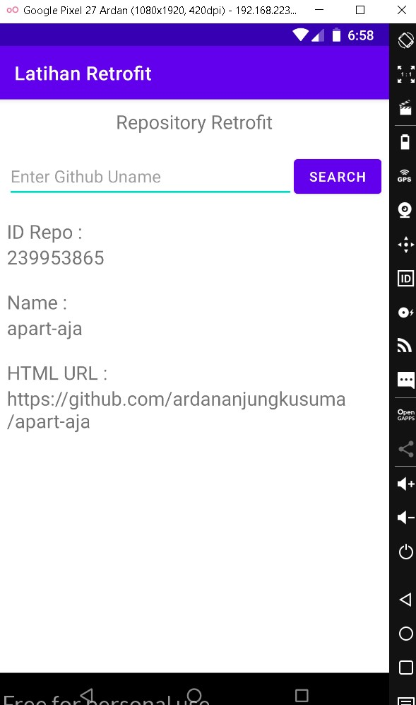
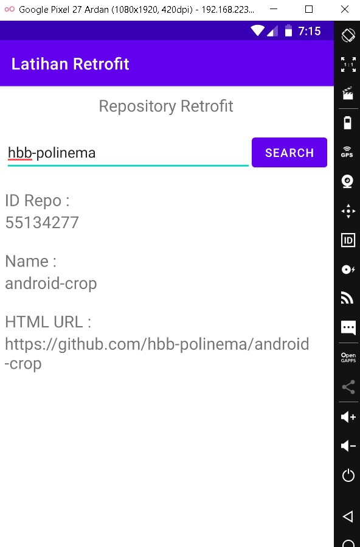

# 11 - Retrofit

## Tujuan Pembelajaran

1. Mahasiswa mampu mengonfigurasi Retrofit pada android;
2. Mahasiswa mampu membuat request ke RESTful API menggunakan Retrofit.

## Hasil Aplikasi

a. Hasil Aplikasi Awal menampilkan repository pertama dari akun github Ardan Anjung Kusuma

b. Saat melakukan fitur pencarian berdasarkan username github

