# 13 - Proyek Uas

## Nama Aplikasi

PokeLove
[Link Apk & Code(Java)](https://github.com/ardananjungkusuma/mobile-3d-07/tree/master/src/13_proyek_uas)

## Deskripsi Aplikasi

Aplikasi Pokedex yang bertujuan memudahkan para Pokémon Trainer untuk mengidentifikasi suatu pokemon yang belum pernah ditemui atau belum pernah dihadapi sebelumnya. Baik dari segi elemen, kekuatan, kelemahan dan informasi mengenai Pokémon itu sendiri.

## Identitas Pengembang (Developer)

NIM : 1841720041
Nama : Ardan Anjung Kusuma
Kelas : TI-3D
Website : http://ardananjungkusuma.github.io/

## Fitur Aplikasi

a. Splash Screen

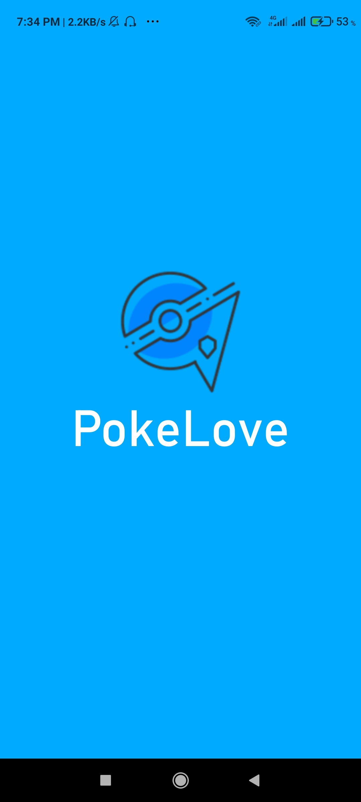

b. Menu Awal Terdapat 5 Menu

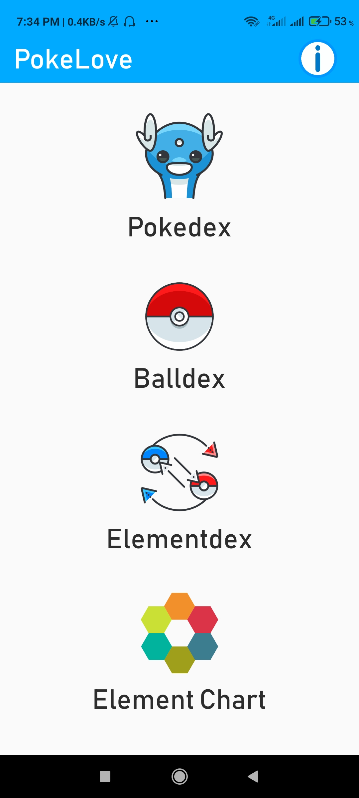

c. Fitur Pokedex yang berisi tentang kumpulan data pokemon. Menggunakan API dari https://raw.githubusercontent.com/synxhronous/pokemon-api/main/pokedex.json

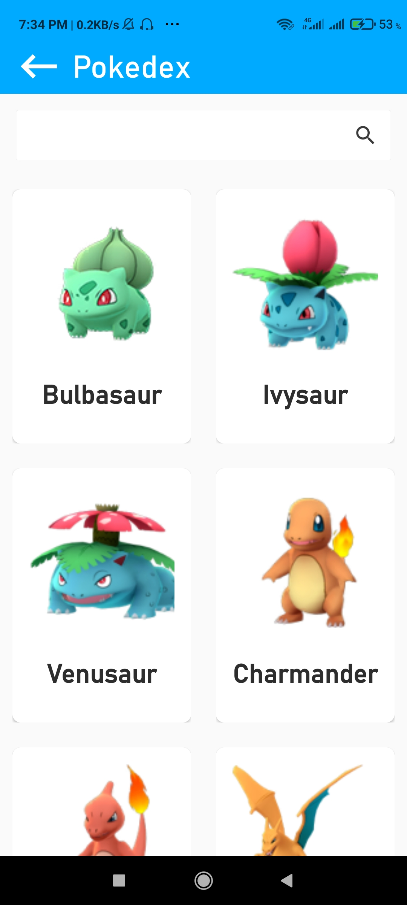

d. Fitur search pada Pokedex

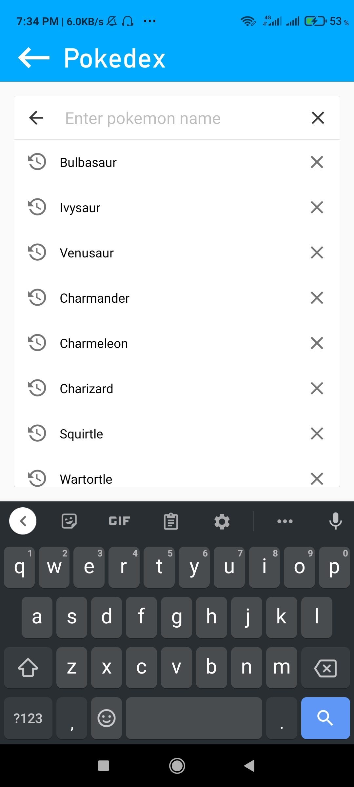

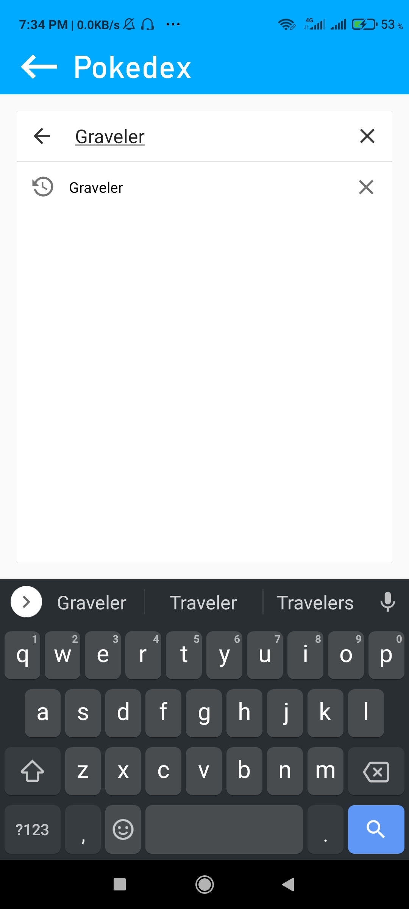

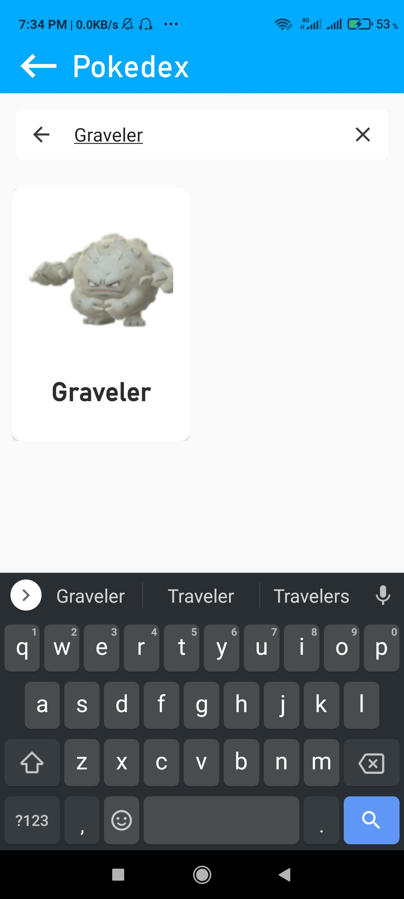

e. Fitur detail pokemon

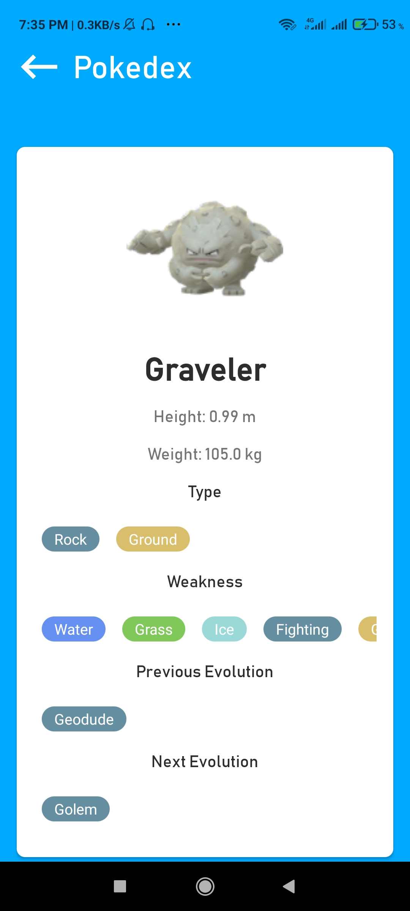

f. Fitur kedua yaitu BallDex yang berisi tentang rangkuman Ball yang ada di Pokemon, diatasnya terdapat news flash yang mengimplementasikan fragment yang nantinya diklik akan ke element chart

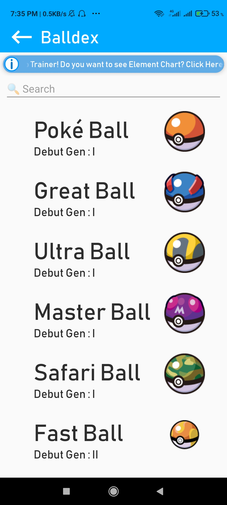

g. Fitur Pencarian bola pada Balldex

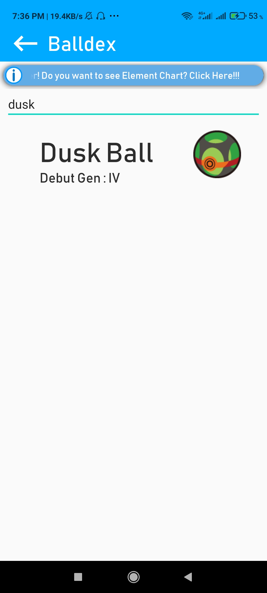

Saat memilih dusk ball

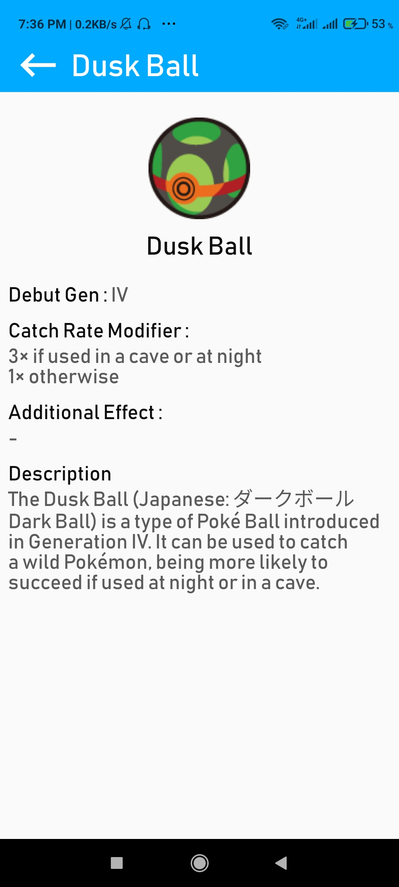

h. Element Dex berisi kumpulan elemen elemen pokemon beserta detailnya jika diklik

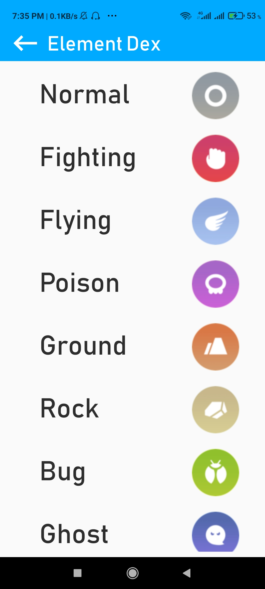

Contoh saat klik elemen poison

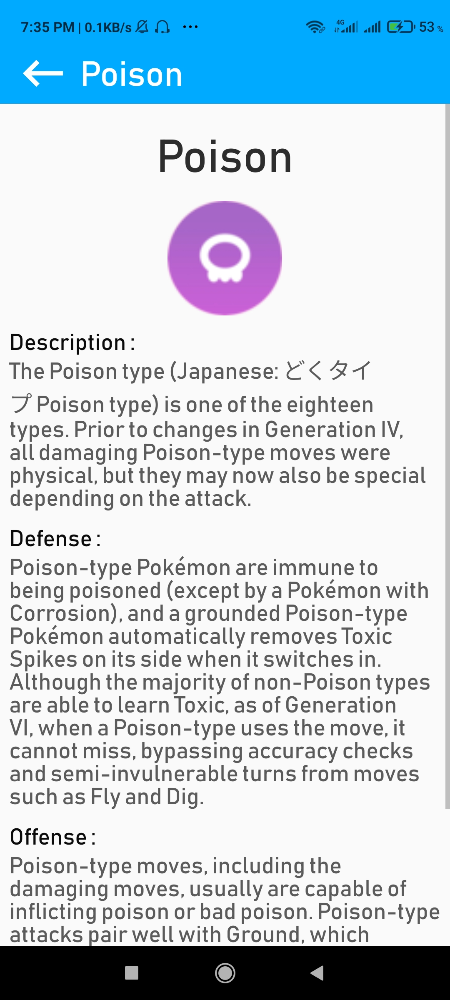

i. Element Chart berisi kumpulan data elemen pokemon yang tentunya sangat berguna saat PvP ataupun melawan pokemon di dunia luar.

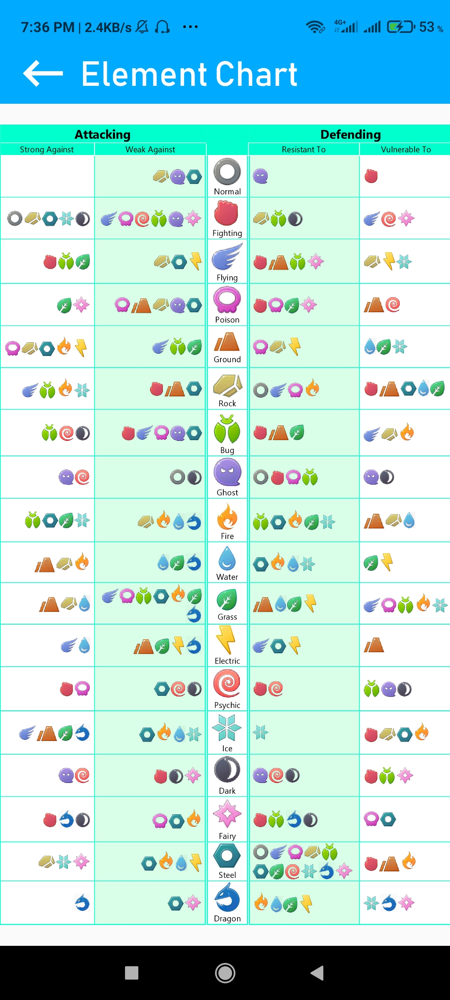

Pastinya bisa dizoom.

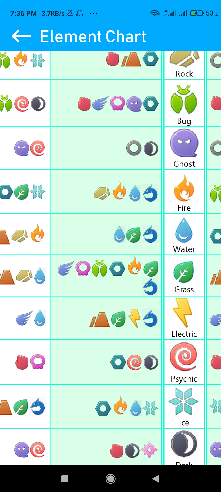

j. Snorlax Game berkonsep membangunkan Snorlax yaitu si Pokemon yang Hobbynya tidur XD. Dengan mengimplementasikan MVVM

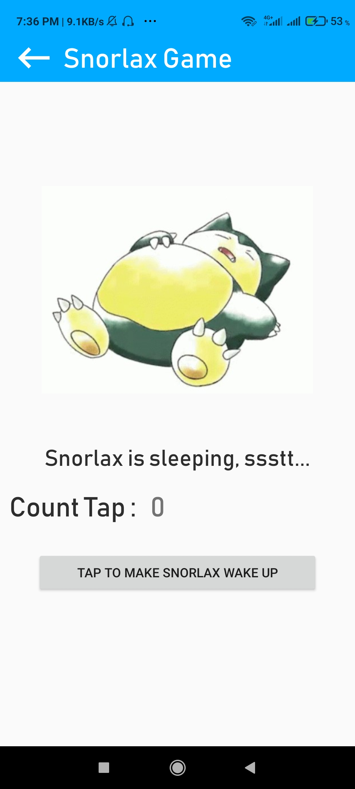

Saat ditap

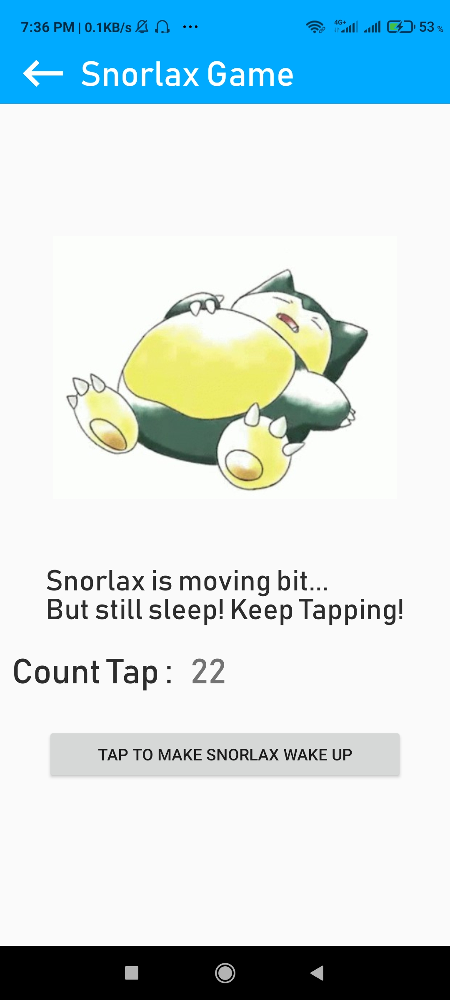

Saat snorlax bangun

k. Fitur informasi mengenai developer dan terdapat fitur contact untuk mengontak developer jika ada request atau bug

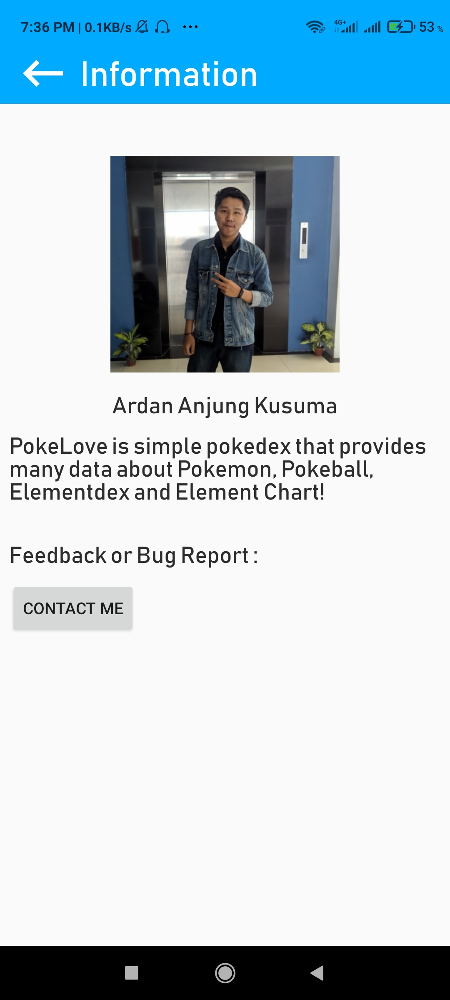

Saat diklik kirim intent untuk memilih email

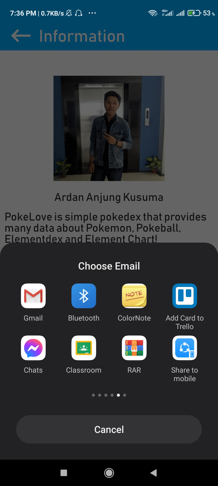

Redirect ke gmail dan anda bisa mengetikan kritik/saran

## Saran

Mungkin kedepannya akan terus dikembangkan

## Kesimpulan

Belajar banyak mengenai mobile programming, mengerjakannya terasa ringan karena memilih topik kesukaan saya.

## Sumber Data & Refrensi

- http://bulbapedia.bulbagarden.net/

- https://github.com/synxhronous/pokemon-api/blob/main/pokedex.json

- https://www.serebii.net/

- https://stackoverflow.com/

- https://www.youtube.com/
